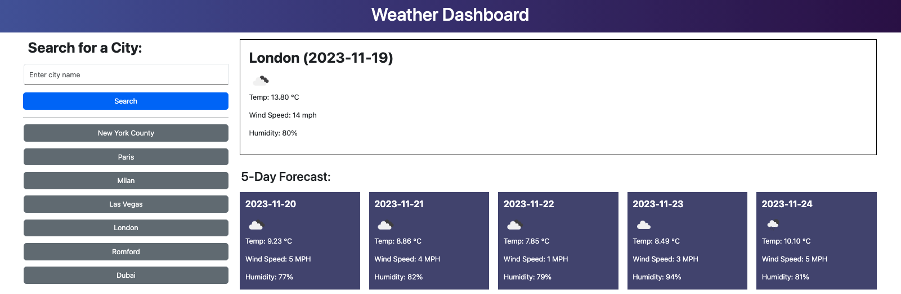

# Weather Dashboard

A weather application allows users to search for a city, displaying its current weather at the top and the forecasted weather for the next 5 days below. Each search generates a corresponding button. Clicking a button retrieves the latest data for that city.

On screen load, the default city on display is London. This prevents the user from seeing a blank screen when they have no cities saved to local storage.

## Application Appearance

View project [here](https://leannecodes.github.io/weather-dashboard/)

## Usage

- Clear local storage before using, as this application may take data keys from another application and create buttons for it.

## Credits

- OpenWeatherMap for the API and guides
- DayJs to display the current date
- Chaining multiple .then() from [here](https://developer.mozilla.org/en-US/docs/Web/JavaScript/Guide/Using_promises)
- Using DOMContentLoaded to show the recent weather data if there is one in local storage [here](https://developer.mozilla.org/en-US/docs/Web/API/Document/DOMContentLoaded_event)
- Targeting a specific value from the DOM [here](https://developer.mozilla.org/en-US/docs/Web/API/Element/querySelector)
- Syntax for the forEach method in parsing through local storage keys [here](https://developer.mozilla.org/en-US/docs/Web/API/Storage/key)
- Capitalise the first letter of each word for the search input [here](https://stackoverflow.com/questions/53906694/how-to-capitalize-the-first-letter-of-each-word-in-an-array-using-array-map-wi)
- Colour gradient for the title [here](https://mycolor.space/gradient?ori=to+right&hex=%234A5BA4&hex2=%232C0D50&sub=1)

